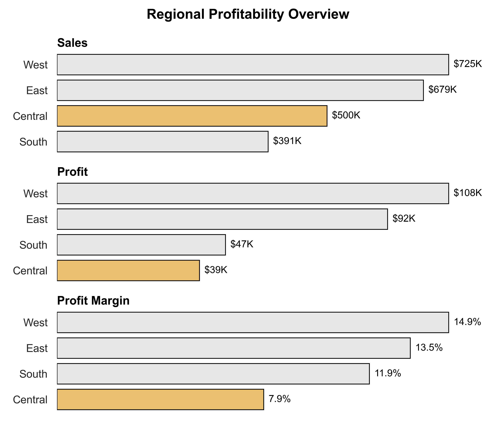
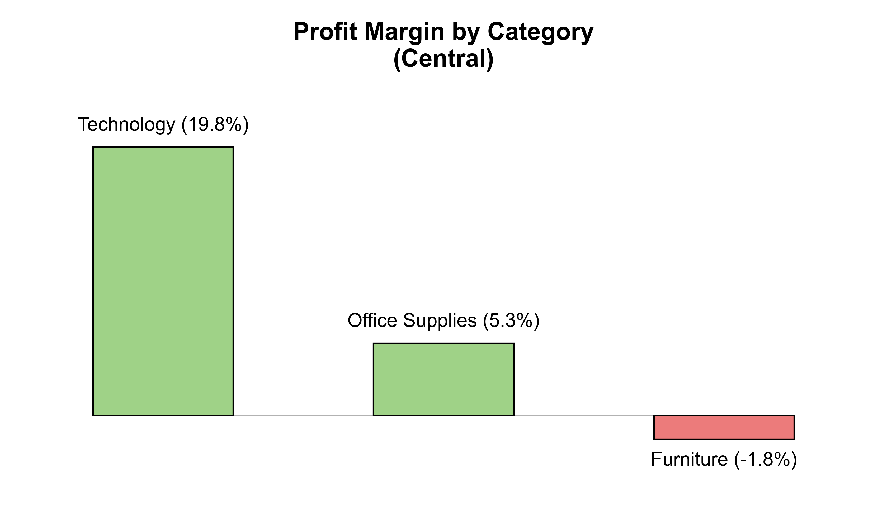
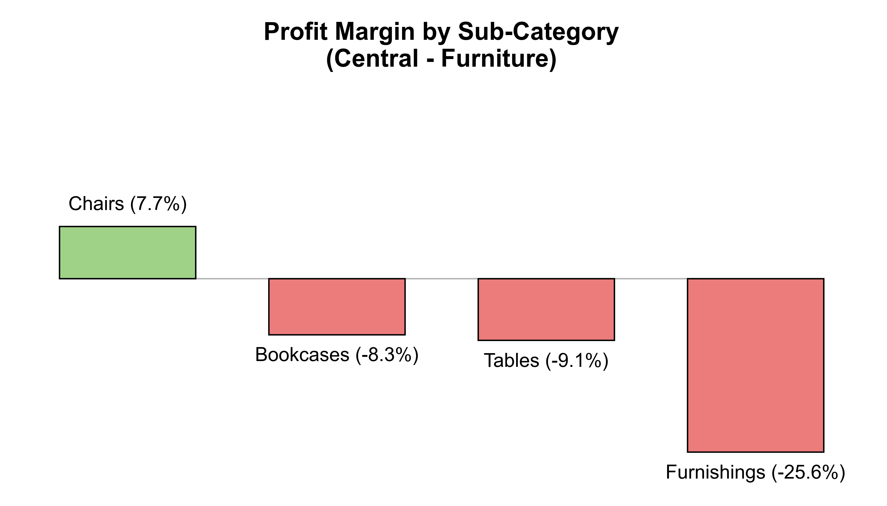
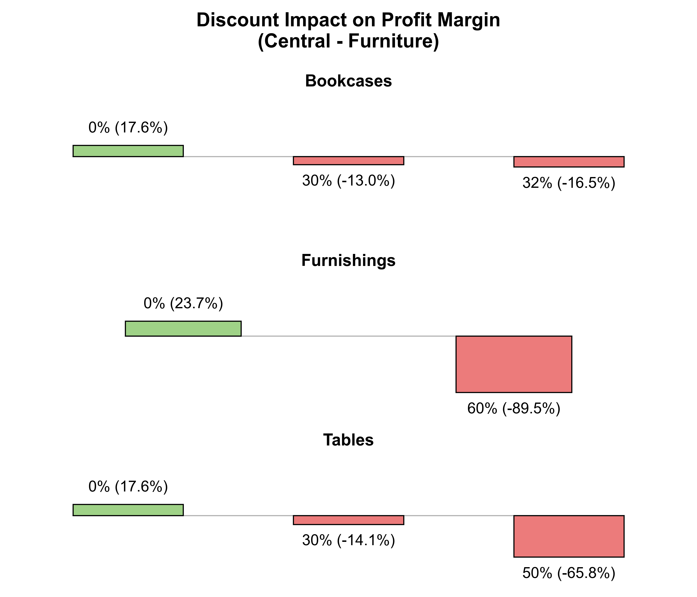
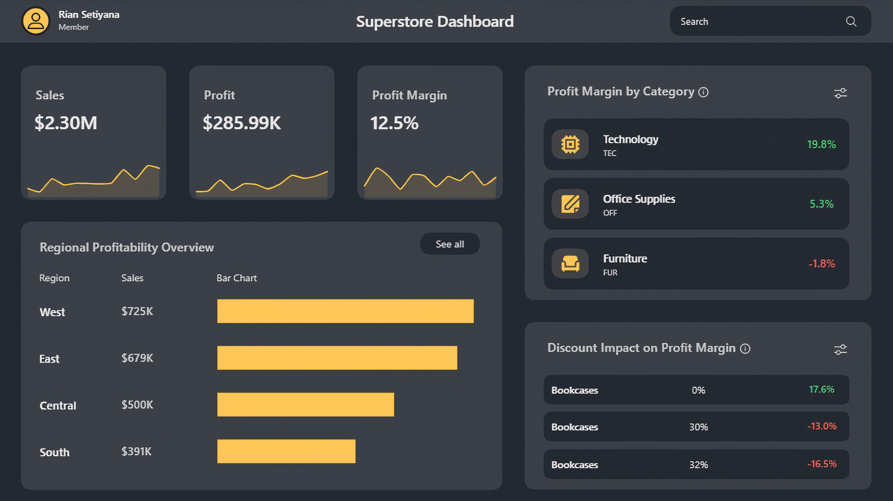

# Strategi Meningkatkan Profit Margin di Region Central

# Ringkasan

Dengan menggunakan data [Superstore](https://www.kaggle.com/datasets/vivek468/superstore-dataset-final), dilakukan analisis untuk meningkatkan profit margin di region Central. Region Central dipilih sebagai fokus analisis karena region tersebut menjadi satu-satunya region yang memiliki profit margin dibawah 10% (underperform). Analisis mencakup identifikasi penyebab rendahnya profit margin hingga evaluasi strategi diskon di region tersebut.

# Pertanyaan Bisnis

1. Region mana yang underperform?
2. Category apa yang mengalami kerugian di region tersebut?
3. Sub-Category apa yang membuat category tersebut merugi?
4. Apakah pemberian diskon memberikan dampak pada sub-category tersebut?
5. Strategi apa yang bisa diterapkan untuk meningkatkan profit margin region tersebut?

# Tools yang Digunakan

## 1. PostgreSQL

Digunakan untuk menulis query pada proses persiapan data.

## 2. Python

Digunakan sebagai tools utama pada proses analisis. Library yang digunakan pada project ini antara lain:

- Pandas: Untuk manipulasi dan pengolahan data.
- Matplotlib: Digunakan sebagai dasar visualisasi data.
- Seaborn: Untuk membuat visualisasi yang lebih informatif.

## 3. Power BI

Digunakan untuk menyajikan hasil analisis dalam bentuk dashboard.

# Persiapan Data

Persiapan data meliputi standarisasi format tanggal pada kolom `order_date` dan `ship_date`, serta standarisasi kode transaksi pada kolom `order_id`.

Detail proses persiapan data dapat dilihat pada file berikut: [Data_Preparation](SQL/Data_Preparation.sql)

### Standarisasi Format Tanggal

```sql
CASE
    WHEN order_date LIKE '% %' THEN
        REGEXP_REPLACE(SPLIT_PART(order_date, ' ', 1), '(\d{4}).(\d{2}).(\d{2})', '\2-\3-\1', 'g')
    ELSE
        REGEXP_REPLACE(order_date, '(\d{1,2}).(\d{2}).(\d{4})', '\2-\1-\3', 'g')
END AS order_date
```

# Proses Analisis

Setiap notebook pada tahap ini difokuskan untuk menjawab satu pertanyaan bisnis. Berikut pendekatan analisis yang digunakan pada masing-masing notebook:

## Region yang Underperform

Proses diawali dengan menghitung total `sales`, `profit`, dan `profit_margin` setiap region. Hasil perhitungan kemudian divisualisasikan dalam bentuk horizontal bar chart untuk membandingkan performa masing-masing region. Dari visualisasi tersebut, region Central teridentifikasi sebagai region yang underperform, dengan profit margin terendah (7.9%) meski sales-nya bukan yang terkecil.

Detail proses analisis dapat dilihat pada notebook berikut: [1_Regional_Profitability_Overview](Python/1_Regional_Profitability_Overview.ipynb)

### Visualisasi Data

<details>
<summary>Lihat kode visualisasi</summary>

```python
sns.set_theme(style='white')
fig, ax = plt.subplots(nrows=3, ncols=1, figsize=(7, 6))
columns = df_agg.columns.tolist()

suptitle_dict = {'size':14,
                 'weight':'bold',
                 'color':'black',
                 'rotation':0,
                 'alpha':1,
                 'family':plt.rcParams['font.family']}

title_dict = {'size':12,
              'weight':'bold',
              'color':'black',
              'loc':'left',
              'rotation':0,
              'pad':5,
              'alpha':1,
              'family':plt.rcParams['font.family']}

for i in range(len(ax)):
    df_plot = df_agg[columns[i]].sort_values(ascending=False)
    palette = ['#FCC658' if region == 'Central' else '#E6E6E6' for region in df_plot.index]
    sns.barplot(x=df_plot.values, y=df_plot.index, ax=ax[i], palette=palette, ec='black', ls='-', lw=0.8)
    
    ax[i].set_title(columns[i].title().replace('_', ' '), **title_dict)
    ax[i].set_ylabel('')
    
    if i in [0, 1]:
        labels = [f'${values/1_000:.0f}K' for values in df_plot.values]
    else:
        labels = [f'{values:.1f}%' for values in df_plot.values]
    
    container = ax[i].containers[0]
    ax[i].bar_label(container=container, labels=labels, size=10, weight='normal', color='black', padding=5)
    
    ax[i].set_xticks(ticks=[])
    sns.despine(left=True, bottom=True, ax=ax[i])

plt.suptitle('Regional Profitability Overview', **suptitle_dict)
plt.tight_layout()
plt.show()
```

</details>

### Hasil



## Category yang Mengalami Kerugian

Proses diawali dengan memfilter data region Central sebagai fokus analisis, kemudian dilanjutkan dengan menghitung `profit_margin` setiap category. Hasil perhitungan kemudian divisualisasikan dalam bentuk bar chart untuk membandingkan profit margin masing-masing category. Dari visualisasi tersebut, category Furniture teridentifikasi sebagai satu-satunya category yang merugi, dengan profit margin -1.8%, jauh berbeda dari Technology (19.8%) dan Office Supplies (5.3%).

Detail proses analisis dapat dilihat pada notebook berikut: [2_Category_Profitability](Python/2_Category_Profitability.ipynb)

### Visualisasi Data

<details>
<summary>Lihat kode visualisasi</summary>

```python
sns.set_theme(style='white')
plt.figure(figsize=(7, 4))
df_agg.sort_values(by='profit_margin', ascending=False, inplace=True)
palette = ['#9ADE7B' if margin > 0 else '#FF6868' for margin in df_agg['profit_margin']]

fig = sns.barplot(x=df_agg.index, y=df_agg['profit_margin'], palette=palette, ec='black', ls='-', lw=0.8)

for bar in fig.patches:
    bar.set_width(0.5)
    bar.set_xy((bar.get_xy()[0] + 0.15, 0))

title_dict = {'size':14,
              'weight':'bold',
              'color':'black',
              'loc':'center',
              'rotation':0,
              'pad':5,
              'alpha':1,
              'family':plt.rcParams['font.family']}
    
plt.title('Profit Margin by Category\n(Central)', **title_dict)
plt.xlabel('')
plt.ylabel('')

ax = plt.gca()
ax.set_ylim(-5, 25)
ax.set_xticks(ticks=[])
ax.set_yticks(ticks=[])
ax.axhline(y=0, xmin=0.083, xmax=0.917, color='black', ls='-', lw=0.8, alpha=0.3)

container = ax.containers[0]
labels = [f'{category} ({margin:.1f}%)' for category, margin in zip(df_agg.index, df_agg['profit_margin'])]
ax.bar_label(container=container, labels=labels, size=11, weight='normal', color='black', padding=7)

plt.tight_layout()
sns.despine(left=True, bottom=True)
plt.show()
```

</details>

### Hasil



## Sub-Category Penyebab Kerugian

Proses diawali dengan memfilter data untuk category Furniture di region Central, kemudian dilanjutkan dengan menghitung `profit_margin` setiap sub-category. Hasil perhitungan kemudian divisualisasikan dalam bentuk bar chart untuk membandingkan profit margin masing-masing sub-category. Dari visualisasi tersebut, terlihat bahwa 3 dari 4 sub-category mengalami kerugian, yakni Bookcases (-8.3%), Tables (-9.1%), dan Furnishings (-25.6%), sementara hanya Chairs yang masih untung (7.7%).

Detail proses analisis dapat dilihat pada notebook berikut: [3_Sub_Category_Profitability](Python/3_Sub_Category_Profitability.ipynb)

### Visualisasi Data

<details>
<summary>Lihat kode visualisasi</summary>

```python
sns.set_theme(style='white')
plt.figure(figsize=(7, 4))
df_agg.sort_values(by='profit_margin', ascending=False, inplace=True)
palette = ['#9ADE7B' if margin > 0 else '#FF6868' for margin in df_agg['profit_margin']]

fig = sns.barplot(x=df_agg.index, y=df_agg['profit_margin'], palette=palette, ec='black', ls='-', lw=0.8)

for bar in fig.patches:
    bar.set_width(0.65)
    bar.set_xy((bar.get_xy()[0] + 0.075, 0))

title_dict = {'size':14,
              'weight':'bold',
              'color':'black',
              'loc':'center',
              'rotation':0,
              'pad':5,
              'alpha':1,
              'family':plt.rcParams['font.family']}    

plt.title('Profit Margin by Sub-Category\n(Central - Furniture)', **title_dict)
plt.xlabel('')
plt.ylabel('')

ax = plt.gca()
ax.set_ylim(-30, 30)
ax.set_xticks(ticks=[])
ax.set_yticks(ticks=[])
ax.axhline(y=0, xmin=0.049, xmax=0.951, color='black', ls='-', lw=0.8, alpha=0.3)

container = ax.containers[0]
labels = [f'{sub_category} ({margin:.1f}%)' for sub_category, margin in zip(df_agg.index, df_agg['profit_margin'])]
ax.bar_label(container=container, labels=labels, size=11, weight='normal', color='black', padding=7)

plt.tight_layout()
sns.despine(left=True, bottom=True)
plt.show()
```

</details>

### Hasil



## Dampak Pemberian Diskon

Proses diawali dengan memfilter data untuk 3 sub-category yang merugi (Bookcases, Tables, Furnishings) di region Central, kemudian dilanjutkan dengan menghitung `profit_margin` berdasarkan sub-category dan tingkat diskon. Hasil perhitungan kemudian divisualisasikan dalam bentuk bar chart untuk membandingkan profit margin di setiap tingkat diskon. Dari visualisasi tersebut, terlihat bahwa profit margin ketiga sub-category selalu positif saat diskon 0%, namun berbalik menjadi negatif begitu diskon diterapkan.

Detail proses analisis dapat dilihat pada notebook berikut: [4_Discount_Impact](Python/4_Discount_Impact.ipynb)

### Visualisasi Data

<details>
<summary>Lihat kode visualisasi</summary>

```python
sns.set_theme(style='white')
fig, ax = plt.subplots(nrows=3, ncols=1, figsize=(7, 6))
df_agg.reset_index(inplace=True)
sub_category = df_agg['sub_category'].unique().tolist()

suptitle_dict = {'size':14,
                 'weight':'bold',
                 'color':'black',
                 'rotation':0,
                 'alpha':1,
                 'family':plt.rcParams['font.family']}

title_dict = {'size':12,
              'weight':'bold',
              'color':'black',
              'loc':'center',
              'rotation':0,
              'pad':5,
              'alpha':1,
              'family':plt.rcParams['font.family']}

for i in range(len(ax)):
    df_plot = df_agg[df_agg['sub_category'] == sub_category[i]].sort_values(by='profit_margin', ascending=False).copy()
    palette = ['#9ADE7B' if margin > 0 else '#FF6868' for margin in df_plot['profit_margin']]
    sns.barplot(data=df_plot, x='discount', y='profit_margin', ax=ax[i], palette=palette, ec='black', ls='-', lw=0.8)
    
    for bar in ax[i].patches:
        if len(df_plot) == 3:
            bar.set_width(0.5)
            bar.set_xy((bar.get_xy()[0] + 0.15, 0))
        else:
            bar.set_width(0.35)
            bar.set_xy((bar.get_xy()[0] + 0.225, 0))
    
    ax[i].set_title(sub_category[i], **title_dict)
    ax[i].set_xlabel('')
    ax[i].set_ylabel('')
    
    container = ax[i].containers[0]
    labels = [f'{discount*100:.0f}% ({margin:.1f}%)' for discount, margin in zip(df_plot['discount'], df_plot['profit_margin'])]
    ax[i].bar_label(container=container, labels=labels, size=11, weight='normal', color='black', padding=7)
    
    ax[i].set_ylim(-100, 100)
    ax[i].set_xticks(ticks=[])
    ax[i].set_yticks(ticks=[])
    
    if len(df_plot) == 3:
        ax[i].axhline(y=0, xmin=0.083, xmax=0.917, color='black', ls='-', lw=0.8, alpha=0.3)
    else:
        ax[i].axhline(y=0, xmin=0.162, xmax=0.838, color='black', ls='-', lw=0.8, alpha=0.3)
    
    sns.despine(left=True, bottom=True, ax=ax[i])

plt.suptitle('Discount Impact on Profit Margin\n(Central - Furniture)', **suptitle_dict)
plt.tight_layout()
plt.show()
```

</details>

### Hasil



# Dashboard Overview

Bagian ini menampilkan dashboard interaktif yang dibuat menggunakan Power BI untuk menyajikan hasil analisis.

File dashboard dapat dilihat disini: [Superstore_Dashboard](Power_BI/Superstore_Dashboard.pbix)

### Tampilan Dashboard:



**Note**: Icon yang digunakan dalam dashboard ini bersumber dari [Magnific](https://www.magnific.com/app).

# Business Recommendation

Untuk langkah awal, berhentikan sementara pemberian diskon serta meninjau kembali strategi pemberian diskon pada region Central khususnya untuk sub-category Bookcases, Tables, dan Furnishings. Hal ini diperlukan karena hasil analisis menunjukkan bahwa sub-category tersebut langsung mengalami kerugian saat diskon diterapkan. Apabila pemberian diskon pada sub-category tersebut dihentikan, profit margin region Central berpotensi meningkat dari 7.9% menjadi 13.4% (naik 5.5%), dengan catatan volume penjualan konstan.

Detail perhitungan dapat dilihat pada notebook berikut: [5_Discount_Simulation_Central](Python/5_Discount_Simulation_Central.ipynb)
